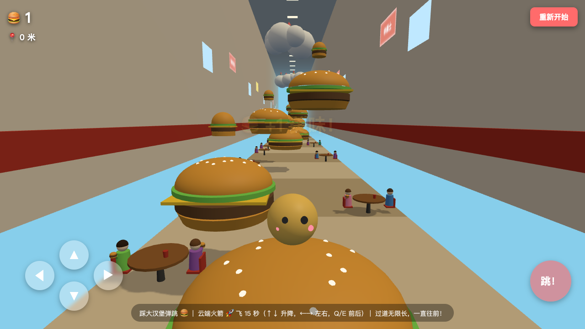
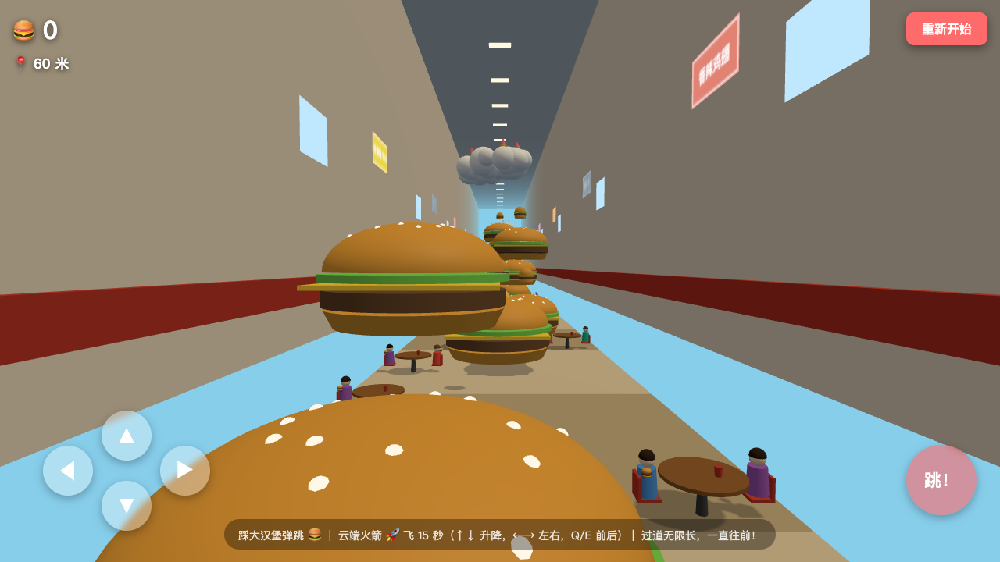
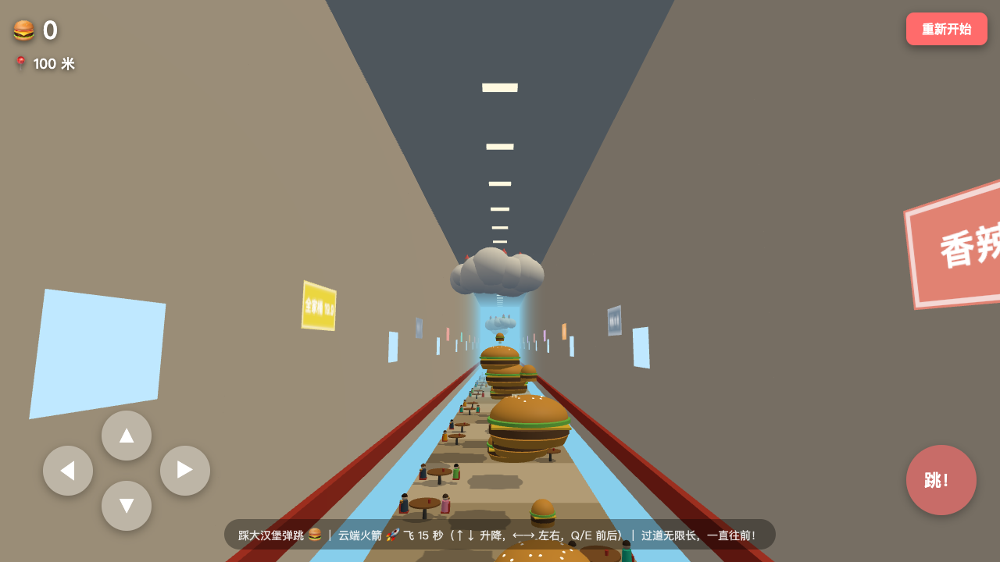

# 🍔 汉堡弹跳 · Burger Bounce

> 在一条无限长的华莱士式餐厅过道里，踩着大汉堡一路弹跳，登上云端，点燃火箭，飞向远方！

## 游戏简介

你是一个圆滚滚的小吃货，出生在餐厅过道里的一个巨型汉堡上。前方是**永远走不到头**的餐厅长廊——两侧坐满正在干饭的顾客，墙上挂着"香辣鸡腿堡 8 元"的菜单牌，头顶是一排排吊灯。

你的目标只有一个：**一直往前，弹得越高、飞得越远越好！**

| 起点：巨型汉堡上弹起 | 餐厅长廊：两侧顾客干饭中 | 云端：火箭待命 |
|---|---|---|
|  |  |  |

## 玩法

| 操作 | 按键 | 屏幕按钮 |
|---|---|---|
| 前进 / 后退 | `↑` `↓` 或 `W` `S` | `▲` `▼` |
| 左 / 右 | `←` `→` 或 `A` `D` | `◀` `▶` |
| 跳跃 | `空格` | `跳！` |
| 飞行中升高 / 下降 | `↑` `↓` | `▲` `▼` |
| 飞行中前进 / 后退 | `Q` `E` | — |

### 核心机制

- 🍔 **大汉堡弹跳台**：踩上去会被高高弹起（带挤压动画），这是前进的主要方式
- ☁️ **云端**：弹得够高就能登上云朵，云朵可以站立（也是检查点）
- 🚀 **火箭**：云朵上停着火箭，碰到即获得 **15 秒飞行燃料**，方向完全自由（升降 / 左右 / 前后），燃料耗尽自动落回重力模式
- 🍔 **小汉堡收集**：汉堡台和云端上飘着可收集的小汉堡，左上角实时计分
- 📍 **距离计**：实时显示你前进了多少米——长廊是**程序化无限生成**的，理论上可以永远跑下去
- 💾 **检查点**：站过的云朵和地板都会记录，摔落自动回到最近检查点

### 长廊里有什么

- 两色相间的地板、米色墙壁 + 红色装饰条、天花板吊灯
- 随机菜单牌：华莱士 / 香辣鸡腿堡 / 巨无霸套餐 / 可乐 5 元 / 全家桶 19.9 …
- 一排排餐桌：圆桌、红椅子、饮料杯，**1~2 位顾客坐着吃饭**（随机发色、衣服颜色，手里举着小汉堡，还会轻轻晃动）

## 运行方式

纯前端单文件游戏，无需构建：

```bash
# 方式一：直接双击打开 index.html
# 方式二：起个本地服务器
python3 -m http.server 8000
# 浏览器访问 http://localhost:8000
```

## 技术栈

- [three.js](https://threejs.org/) (r160) — WebGL 3D 渲染，CDN 引入
- 原生 JavaScript (ES Modules)，零依赖、零构建
- 程序化区块生成（每 30 米一个区块，前方自动生成、身后自动回收，无限长廊不卡顿）
- 共享几何体 / 材质优化，Canvas 纹理菜单牌

## 版本记录

| 版本 | 内容 |
|---|---|
| v1 | 基础平台跳跃、收集汉堡、甜甜圈弹簧、屏幕按钮 |
| v2 | 地砖全部改为大汉堡（踩上弹跳）、云端 + 火箭飞行（15 秒燃料） |
| v3 | 华莱士式无限餐厅长廊：程序化生成环境（地板 / 墙 / 菜单牌 / 吊灯 / 餐桌 / 吃饭 NPC）、无限汉堡与云端火箭、距离计 |

## 许可证

仅供学习娱乐使用。
